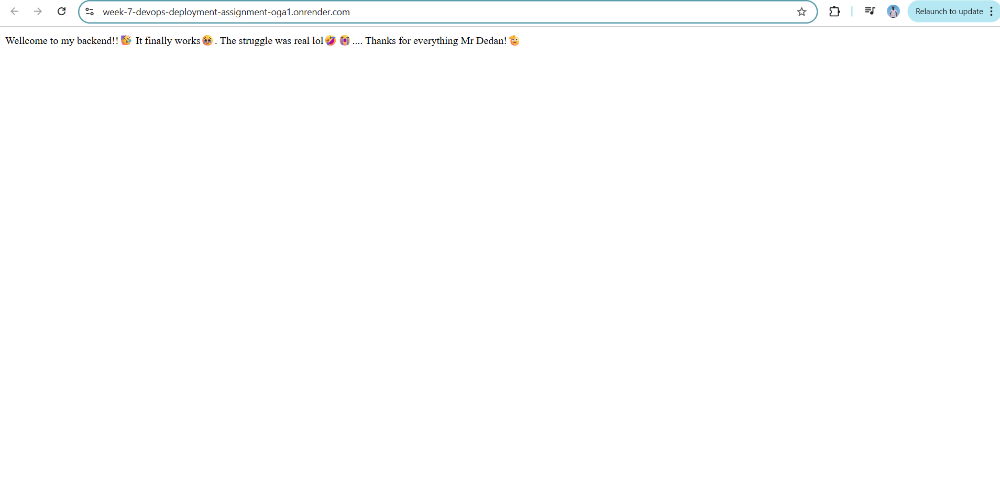
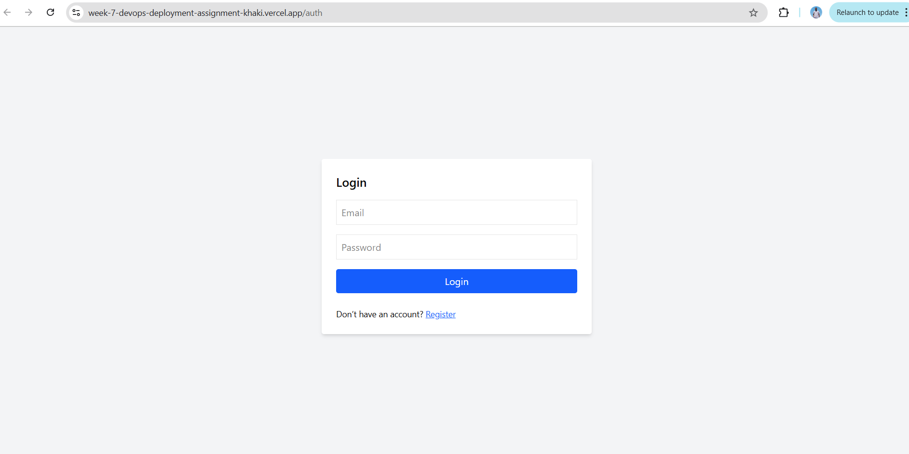
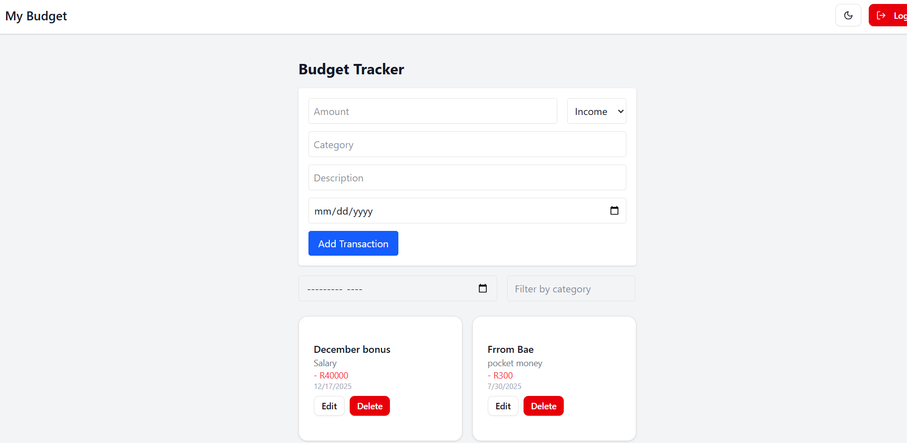
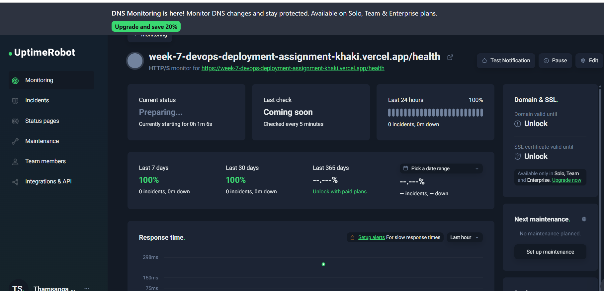
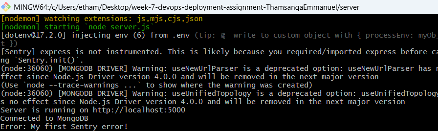

# 🚀 Budget Tracker – Week 7: Deployment and DevOps Essentials

A full-stack MERN (MongoDB, Express, React, Node.js) Budget Tracker application deployed to production with CI/CD, monitoring, and error tracking.

---

## 🌐 Live Demo

- **Frontend (Vercel):** https://week-7-devops-deployment-assignment-khaki.vercel.app/auth ::: https://week-7-devops-deployment-assignment-khaki.vercel.app/
- **Backend (Render):** https://week-7-devops-deployment-assignment-oga1.onrender.com

---

## 🎯 Objective

This project demonstrates how to:

- Prepare a MERN application for production
- Deploy both frontend and backend
- Set up CI/CD pipelines
- Monitor app health and performance
- Implement rollback and maintenance strategies

---

## 📦 Tech Stack

- **Frontend:** React + Tailwind CSS (Vite)
- **Backend:** Express.js + Node.js
- **Database:** MongoDB Atlas
- **Deployment:**
  - **Frontend:** Vercel
  - **Backend:** Render
- **CI/CD:** GitHub Actions
- **Monitoring:** UptimeRobot, Sentry

---

## 🧰 Features

- Add, edit, delete, and filter transactions
- Dark mode toggle
- Auth-protected dashboard
- Responsive UI
- Persistent theme with localStorage
- Monitoring and error tracking in production

---

## 📂 Deployment Tasks

### ✅ Task 1: Preparing the Application

**Frontend**
- Vite build setup
- Code splitting and lazy loading
- `.env` setup with `VITE_API_URL`

**Backend**
- Production error handling
- Helmet for security headers
- Logging and environment configs
- Connection pooling with MongoDB Atlas

---

### ✅ Task 2: Deploying the Backend

- ✅ Hosted on **Render**
- ✅ Environment variables configured securely
- ✅ GitHub repo linked for automatic deployment
- ✅ CORS configured for frontend
- ✅ HTTPS supported (auto via Render)

---

### ✅ Task 3: Deploying the Frontend

- ✅ Hosted on **Vercel**
- ✅ Auto builds on push to `main`
- ✅ `.env` for API base URL
- ✅ Fast CDN delivery with caching

---

### ✅ Task 4: CI/CD Setup

- ✅ GitHub Actions for:
  - Linting
  - Running backend tests
  - Auto-deploy on push to `main`
- ✅ Environment secrets configured in GitHub

---

### ✅ Task 5: Monitoring & Maintenance

- ✅ **UptimeRobot** to monitor backend API and frontend URL
- ✅ **Sentry** for real-time error tracking (frontend and backend)
- ✅ `/health` endpoint for Render monitoring
- ✅ Database backups via MongoDB Atlas
- ✅ Documented rollback steps in case of failure

---

## Screenshot

